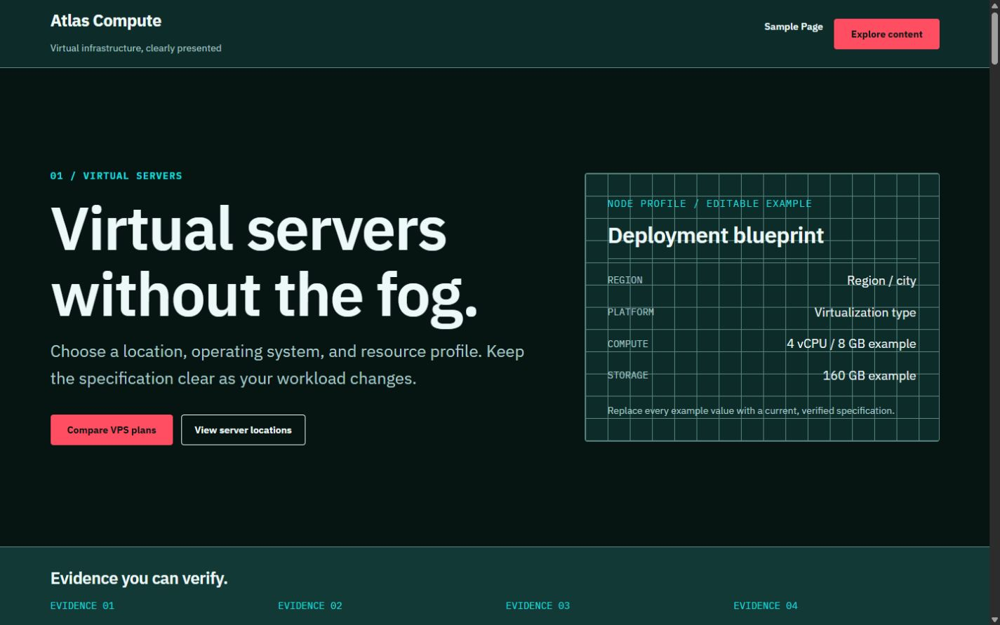
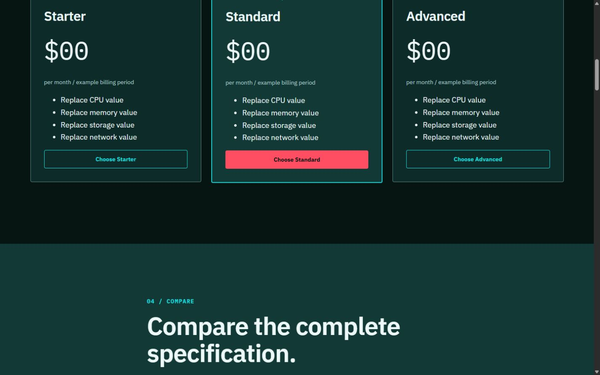
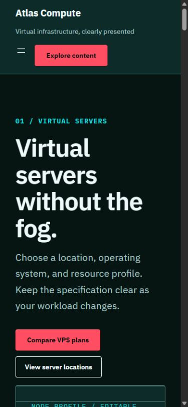

# MonoVM Blueprint Preview Gallery

These screenshots were captured from a clean WordPress 7.1 installation using
the default Dark Infrastructure style. They show the real theme output and are
approved for reuse on the MonoVM download landing page.

## Desktop homepage

The opening view shows the responsive header, primary service message, calls to
action, and editable deployment blueprint.

## Plans and comparison

The plans section demonstrates three editable resource profiles followed by a
detailed specification comparison.

## Mobile homepage

The mobile view shows the collapsed navigation, stacked hero content, readable
type scale, and touch-friendly actions.

## Publishing notes

- Use the desktop homepage image as the primary product-page visual.
- Present the plans and mobile images as supporting gallery items.
- Keep the images uncropped when possible so visitors can judge spacing and
  responsive behavior accurately.
- The placeholder brand and plan data are intentionally neutral and should not
  be presented as a current MonoVM service offer.
